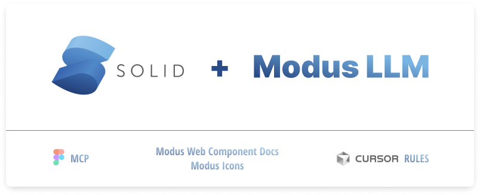

# SolidJS + Modus Web Component Docs + Cursor Rules & Figma MCP

A comprehensive SolidJS project template and documentation repository featuring Trimble Modus Web Components integration, intelligent AI assistance with Cursor Memories, and enterprise-grade development standards.

## 🚀 Getting Started

### 1. How to use Figma MCP

Configure the Figma Model Context Protocol integration to seamlessly bridge design and development workflows with AI assistance.

### 2. How to setup Cursor Rules

Implement comprehensive project rules and AI memories to ensure consistent development patterns and enhanced code quality.

### 3. What is included in the repository

Explore the complete documentation ecosystem including 40+ component guides, development standards, and intelligent AI enhancement tools.

## 🎯 Project Overview

This repository provides:

- **SolidJS Framework Integration** with Modus Web Components
- **Cursor AI Enhancement** through intelligent memories and project rules
- **Comprehensive Documentation** for 40+ Modus Web Components
- **Development Workflow Standards** and quality assurance guidelines
- **MCP (Model Context Protocol)** integration for enhanced AI assistance

### Technology Stack

- **Framework**: SolidJS/SolidStart with TypeScript
- **UI Components**: Trimble Modus Web Components (`@trimble-oss/moduswebcomponents`)
- **Icons**: Modus Icons font system
- **Styling**: Modus CSS custom properties with optional Tailwind CSS
- **AI Enhancement**: Cursor IDE with intelligent memories and project rules

## 🗂️ Repository Structure

```
SolidJS/
├── 📋 Cursor Memories/          # AI memory system for project context
│   └── cursor-memories-guide.md # Complete guide to Cursor Memories usage
├── 📐 Cursor Project Rules/      # AI assistant project rules
│   ├── modus-web-components.mdc  # Web component integration standards
│   ├── modus-boilerplate-rules.mdc # SolidJS + Modus boilerplate rules
│   ├── modus-colors.mdc         # Color system guidelines
│   ├── modus-color-reference.mdc # Complete color reference
│   ├── modus-icon-names.mdc     # Available icon names
│   └── icon-placement.mdc       # Icon usage patterns
├── 👤 Cursor User Rule/          # Personal workflow preferences
│   └── user-rule.md             # Development workflow and quality standards
├── 🔌 MCP/                      # Model Context Protocol configuration
│   └── mcp.json                 # MCP server configuration
└── 📚 WebComponentsDocs/         # Complete component documentation
    ├── modus-wc-accordion.md    # 40+ individual component guides
    ├── modus-wc-alert.md        # Each with props, events, and examples
    └── ... (40+ component docs)
```

## 🚀 Quick Start

### 1. Set Up Your SolidJS Project

```bash
# Create a new SolidJS project
npm create solid@latest my-modus-app
cd my-modus-app

# Install Modus Web Components
npm install @trimble-oss/moduswebcomponents @trimble-oss/modus-icons
```

### 2. Configure Modus Integration

**Install and Register Components** (in `entry-client.tsx`):

```typescript
import { defineCustomElements } from "@trimble-oss/moduswebcomponents/loader";

// Register custom elements (client-side only)
defineCustomElements();
```

**Import Required Styles** (in your main app component):

```typescript
import "@trimble-oss/moduswebcomponents/modus-wc-styles.css";
import "@trimble-oss/modus-icons/dist/field-systems/fonts/modus-icons.css";
```

### 3. Set Up Cursor AI Enhancement

1. **Copy Cursor Memories**: Follow the [Cursor Memories Guide](./Cursor%20Memories/cursor-memories-guide.md)
2. **Apply Project Rules**: Add rules from `Cursor Project Rules/` to Cursor Settings → Rules
3. **Configure User Preferences**: Use guidelines from `Cursor User Rule/user-rule.md`
4. **Enable MCP**: Configure Model Context Protocol using `MCP/mcp.json`

## 💡 Key Features

### Intelligent AI Assistance with Cursor Memories

This repository includes a comprehensive **Cursor Memories system** that provides:

- **Automatic Context Retention** across development sessions
- **Project-Specific Knowledge** about SolidJS and Modus Web Components
- **Quality Standards Enforcement** through AI-powered code review
- **Pattern Consistency** ensuring best practices are followed

**Essential Memory Categories:**

- SolidJS Framework Standards
- Modus Web Component Integration
- TypeScript Declarations
- SSR and Hydration Handling
- Color System and Theming
- Icon Usage Validation
- Performance Optimization

### Comprehensive Component Documentation

Access detailed documentation for **40+ Modus Web Components**:

**Form Elements:**

- `modus-wc-button`, `modus-wc-text-input`, `modus-wc-textarea`
- `modus-wc-select`, `modus-wc-checkbox`, `modus-wc-radio`
- `modus-wc-number-input`, `modus-wc-date`, `modus-wc-time-input`

**Layout & Navigation:**

- `modus-wc-card`, `modus-wc-navbar`, `modus-wc-tabs`
- `modus-wc-breadcrumbs`, `modus-wc-side-navigation`

**Feedback & Indicators:**

- `modus-wc-alert`, `modus-wc-badge`, `modus-wc-progress`
- `modus-wc-toast`, `modus-wc-loader`, `modus-wc-skeleton`

**Advanced Components:**

- `modus-wc-table`, `modus-wc-modal`, `modus-wc-dropdown-menu`
- `modus-wc-autocomplete`, `modus-wc-pagination`

## 🛠️ Development Workflow

### Mandatory Todo List System

Every development task must follow this workflow:

1. **📝 CREATE TODO LIST** using `todo_write` tool - NEVER SKIP
2. **🎯 ANALYZE** requirements against project standards
3. **💻 IMPLEMENT** using established patterns and best practices
4. **🔍 REVIEW** code for quality and consistency
5. **✅ MARK TODOS COMPLETE** when finished

### Quality Assurance Checklist

Before completing any task, ensure:

- [ ] Todo list created and all items marked complete
- [ ] Code follows project technical standards
- [ ] Uses project's established component patterns
- [ ] Maintains consistency with project conventions
- [ ] Personal satisfaction with code quality and clarity

## 🎨 Styling and Theming

### CSS Custom Properties

**CRITICAL**: Always use Modus CSS custom properties for colors:

```css
/* ✅ Correct - Uses Modus color system */
.my-component {
  background-color: var(--modus-wc-color-primary);
  color: var(--modus-wc-color-base-page);
  border: 1px solid var(--modus-wc-color-border);
}

/* ❌ Incorrect - Hardcoded colors break theming */
.my-component {
  background-color: #0077c8;
  color: #ffffff;
}
```

### Theme Configuration

Set up theming in your main app component:

```typescript
import { onMount } from "solid-js";

onMount(() => {
  document.documentElement.className = "light";
  document.documentElement.setAttribute("data-theme", "modus-classic-light");
  document.documentElement.setAttribute("data-mode", "light");
});
```

## 🔧 TypeScript Integration

### Component Declarations

Add new Modus components to your TypeScript declarations:

```typescript
// In global.d.ts or similar
declare module "solid-js" {
  namespace JSX {
    interface IntrinsicElements {
      "modus-wc-button": {
        color?: "primary" | "secondary" | "tertiary";
        variant?: "fill" | "outline" | "borderless";
        size?: "small" | "medium" | "large";
        disabled?: boolean;
        "aria-label"?: string;
        onClick?: (event: CustomEvent) => void;
      };
      // Add other components as needed
    }
  }
}
```

## 🏗️ SSR and Hydration

### Mount Guard Pattern

Prevent hydration mismatches with the mount guard pattern:

```tsx
import { createSignal, onMount, Show } from "solid-js";

export default function MyComponent() {
  const [mounted, setMounted] = createSignal(false);
  onMount(() => setMounted(true));

  return (
    <Show when={mounted()} fallback={<div>Loading...</div>}>
      <modus-wc-button>My Button</modus-wc-button>
    </Show>
  );
}
```

## 🎯 Icon Usage

### Modus Icons

Use Modus icons with the `modus-icons` class:

```tsx
// ✅ Correct icon usage
<i class="modus-icons">settings</i>

// ✅ Icons in buttons
<modus-wc-button>
  <i class="modus-icons">add</i>
  <span>Add Item</span>
</modus-wc-button>

// ❌ Incorrect - component doesn't exist
<modus-wc-icon name="settings" />
```

**Common Valid Icons:**
`settings`, `person`, `delete`, `add`, `remove`, `search`, `close`, `check`, `warning`, `error`, `info`, `home`, `menu`, `arrow_up`, `arrow_down`, `arrow_left`, `arrow_right`

## 🤖 AI Enhancement Setup

### Cursor Memories Configuration

1. **Read the Guide**: Start with [Cursor Memories Guide](./Cursor%20Memories/cursor-memories-guide.md)

2. **Essential Memories**: Create these foundational memories:

   - SolidJS Framework Standards
   - Modus Web Component Standards
   - Styling & Design System Standards
   - Code Quality Standards
   - Performance & Best Practices
   - Icon Usage Validation

3. **Access Management**: Go to **Cursor Settings → Rules** to manage memories

### MCP Integration

Configure Model Context Protocol for enhanced AI capabilities:

```json
{
  "mcpServers": {
    "Context7": {
      "type": "stdio",
      "command": "npx",
      "args": ["-y", "@upstash/context7-mcp@latest"]
    },
    "Figma": {
      "url": "http://127.0.0.1:3845/sse"
    }
  }
}
```

## 📖 Documentation Reference

### Component Documentation

- **Individual Components**: See `WebComponentsDocs/` for detailed component guides
- **Integration Patterns**: Reference `Cursor Project Rules/modus-web-components.mdc`
- **Boilerplate Standards**: Follow `Cursor Project Rules/modus-boilerplate-rules.mdc`

### Color and Design System

- **Color Reference**: Complete color system in `Cursor Project Rules/modus-color-reference.mdc`
- **Icon Names**: Valid icon list in `Cursor Project Rules/modus-icon-names.mdc`
- **Usage Patterns**: Icon placement guide in `Cursor Project Rules/icon-placement.mdc`

### Workflow and Standards

- **Development Workflow**: Personal workflow preferences in `Cursor User Rule/user-rule.md`
- **Memory Management**: Complete guide in `Cursor Memories/cursor-memories-guide.md`

## 🤝 Contributing

1. **Follow the Workflow**: Always create todo lists using the `todo_write` tool
2. **Reference Documentation**: Check component docs before adding new Modus components
3. **Maintain Standards**: Follow established patterns and TypeScript declarations
4. **Update Memories**: Create or update Cursor memories when establishing new patterns

## 📜 License

This project documentation and standards are provided as-is for educational and development purposes. Modus Web Components are licensed by Trimble Inc.

## 🔗 Related Links

- [Modus Web Components Documentation](https://modus-web-components.trimble.com/)
- [SolidJS Documentation](https://www.solidjs.com/)
- [Cursor IDE Documentation](https://docs.cursor.com/)
- [Trimble Modus Design System](https://modus.trimble.com/)

---

**Ready to build amazing SolidJS applications with Modus Web Components and intelligent AI assistance!** 🚀
